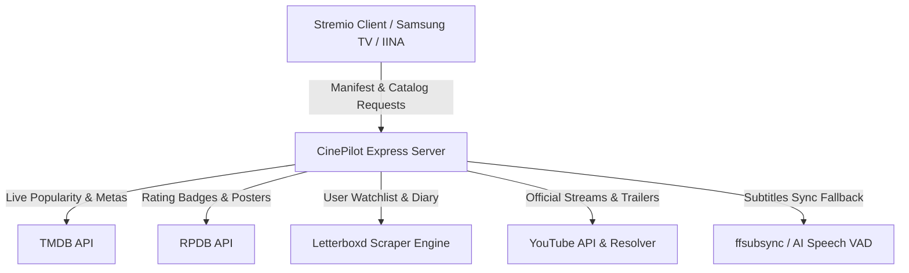

# 🚀 CinePilot — Ultimate Cinema Suite for Stremio

<p align="center">
  
</p>

<p align="center">
  
  
  
  
  
</p>

---

## 🌟 Overview

**CinePilot** is a next-generation, high-performance **Stremio Addon Suite** designed for cinephiles, 4K BluRay Remux enthusiasts, and smart TV setups (Samsung M7 / Tizen OS, Android TV, macOS, Web).

It bridges the gap between **Letterboxd**, **TMDB**, **RPDB (Rating Poster DB)**, **IMDb**, and official **YouTube Full HD streaming archives** into a single, unified, 24/7 cloud-hosted catalog engine.

---

## ⚡ Live Addon URL (1-Click Install)

Copy and paste the manifest URL directly into Stremio's search bar:

```text
https://cinepilot-8mg0.onrender.com/manifest.json
```

> **Compatible with:** Samsung Smart TV (Tizen OS), LG webOS, Android TV / Google TV, macOS (Stremio & IINA), Windows, Linux, iOS & Android.

---

## ✨ Key Features

### 1. 🔥 100+ Weekly Trending Engine (Auto-Updating)
* Automatically queries TMDB across multiple pages in parallel to provide **100+ trending movies** and **100+ trending series** every week.
* **2-hour smart cache:** Stays perpetually fresh without requiring server restarts or manual maintenance.

### 2. 🏆 Curated World-Class Collections
* **✨ Oscar Best Picture Winners & Nominees:** ~96 legendary cinematic achievements.
* **🏆 IMDb & Letterboxd Top 250:** The highest-rated masterpieces of all time.
* **🎸 Rolling Stone Top 100 TV Series:** The greatest television series ever produced.
* **🌸 Popüler Kore Dizileri (K-Drama Archive):** 97 trending and classic Korean dramas (*Squid Game, Crash Landing on You, Goblin, The Glory, Moving, Queen of Tears, Vincenzo...*).
* **🇹🇷 Türk Sineması Başyapıtları:** 88 authentic Turkish cinema classics (*Nuri Bilge Ceylan, Zeki Demirkubuz, Yavuz Turgul, Yeşilçam efsaneleri, Cem Yılmaz*) with 100% authentic Turkish posters.
* **💥 Aksiyon Sineması Başyapıtları:** 128 diverse modern action blockbusters (*John Wick, Extraction, The Raid, Top Gun, Sicario, Heat, Mission Impossible, Bourne...*).
* **📺 Efsane & Popüler Türk TV Dizileri:** 65 iconic Turkish free television series (*Ezel, Kurtlar Vadisi, Aşk-ı Memnu, Behzat Ç., Avrupa Yakası, Leyla ile Mecnun, Kuzey Güney, İçerde, Çukur, Yaprak Dökümü, Doktorlar...*).

### 3. 🍿 Official YouTube 1080p Full Episode & Movie Streaming
* Resolves official yapımcı/broadcaster 1080p YouTube broadcasts natively inside Stremio.
* **Dynamic Series Navigation:** Automatically opens **Season 1 Episode 1** with authentic episode scene thumbnails, Turkish synopses, and original air dates.
* **IINA & External Player Support:** Provides valid `externalUrl` links for instant playback in IINA Player via `mpv`.

### 4. 🎬 Official 4K & HD Trailers
* Restores official Turkish and English studio trailers for every movie and series in the world.

### 5. 🔍 Global Search & Bilingual Genre Filtering
* Integrated with Stremio's global search bar for instant title matching across all catalogs.
* **Bilingual Genre Matcher:** Seamlessly filters across English & Turkish metadata (*Aksiyon, Bilim Kurgu, Dram, Komedi, Gerilim, Suç & Gizem, Romantik...*).

---

## 🛠️ Tech Stack & Architecture



* **Backend:** Node.js 20, Express.js
* **Scraping Engine:** Python 3 `cloudscraper` & `BeautifulSoup4`
* **Media Pipelines:** `yt-dlp`, `ffmpeg`, `ffsubsync` (Voice Activity Detection)
* **Cloud Hosting:** Render.com (Blueprint IaC), Docker Container, Vercel Serverless

---

## 🚀 Self-Hosting & Deployment

### Option A: 1-Click Cloud Deployment via Render.com (Recommended)
1. Fork or clone this repository to your GitHub account.
2. Go to [render.com](https://render.com) -> Click **New +** -> **Blueprint**.
3. Connect your `CinePilot` repository. Render automatically reads `render.yaml` and launches your 24/7 web service.

### Option B: Docker Container
```bash
# Build the Docker image
docker build -t cinepilot .

# Run container on port 7050
docker run -d -p 7050:7050 --name cinepilot-suite cinepilot
```

### Option C: Local Development
```bash
# Clone the repository
git clone https://github.com/cagrigoksel/CinePilot.git
cd CinePilot

# Install dependencies
npm install
pip3 install cloudscraper beautifulsoup4

# Start local server
node server.js
```
Local server will be available at `http://127.0.0.1:7050`.

---

## 🔊 IINA AI Subtitle Sync Integration (macOS)

For 4K Remuxes with desynchronized external subtitles:

1. **In-Player 1-Key Sync:**
   * Open movie in IINA -> Press **`n`** -> Select **"Sync to audio (ffsubsync)"**.
   * In ~3 seconds, speech recognition aligns subtitles with 0ms offset.
2. **Terminal Quick Sync:**
   ```bash
   ffsubsync "movie_file.mkv" -i "out_of_sync.srt" -o "synced.srt"
   ```

---

## 📄 License

This project is licensed under the [MIT License](LICENSE).

---

<p align="center">
  Crafted with ❤️ by <a href="https://github.com/cagrigoksel">Bican Çağrı Göksel</a> for the global cinema & Stremio community.
</p>
